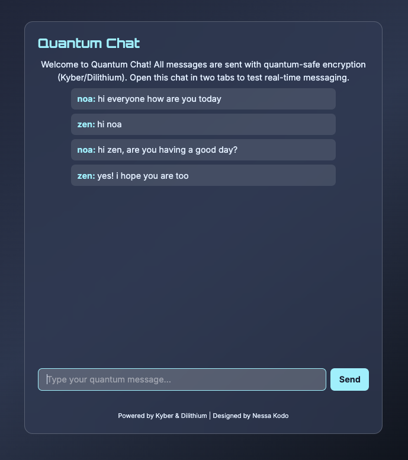

# 𝘊𝘙𝘠𝘗𝘛𝘐𝘘 𝘘𝘶𝘢𝘯𝘵𝘶𝘮-𝘚𝘢𝘧𝘦 𝘊𝘩𝘢𝘵


[](https://www.python.org)
[](https://flask.palletsprojects.com/)
[](LICENSE)
[](https://nessakodo.com)

---

## 𝘜𝘱𝘥𝘢𝘵𝘦𝘴

CRYPTIQ v0.1 is a modern, real-time encrypted chat demo:

* Built with **Next.js (frontend)** + **Flask-SocketIO (backend)**
* **Glassmorphic, cyber-zen UI** with Orbitron + Inter fonts
* **Quantum-safe encryption (Kyber, Dilithium)** concepts (future: E2E)
* **Persistent in-memory chat history** for all new users joining
* **Username support** for multi-user real-time demo
* **Render/Vercel-ready** for instant deployment

---

## 𝘍𝘦𝘢𝘵𝘶𝘳𝘦𝘴

* Realtime, broadcasted group chat
* Username modal on entry (anonymous handle)
* Distinct styling for each sender
* Persistent chat history (for current server session)
* Quantum cryptography banner and UI badge
* Fully responsive, glassy UI
* All code open source

---

## 𝘒𝘯𝘰𝘸𝘯 𝘉𝘶𝘨: 𝘊𝘩𝘢𝘵 𝘏𝘪𝘴𝘵𝘰𝘳𝘺 𝘎𝘭𝘪𝘵𝘤𝘩

When new users join, they receive all past messages as history. However:

* **Only messages sent after a user connects will appear in real time.**
* If a user refreshes, they get the full previous history, but won't see any messages sent while they were disconnected.
* If you have two users ("noa" and "zen"), and "zen" joins first, "zen" will *not* see "noa's" past messages until they refresh. This is by design of in-memory chat (not persistent in DB).

---

## 𝘐𝘯𝘵𝘦𝘳𝘧𝘢𝘤𝘦 𝘗𝘳𝘦𝘷𝘪𝘦𝘸𝘴

### **Single User (First Join)**



### **Multiple Users (Incognito Join)**


*(Each user sees chat history up to their join time. Refreshing fetches full history.)*

---

## 𝘏𝘰𝘸 𝘐𝘵 𝘞𝘰𝘳𝘬𝘴

* **One backend, many frontends**: All browser tabs connect to the same Flask-SocketIO server
* **Messages are broadcast** to all currently connected users
* **Joining emits a “join” event** so the server sends full chat history to the new user
* **Chat history is in-memory** (lost on backend restart, upgrade to DB planned)

---

## 𝘘𝘶𝘪𝘤𝘬 𝘚𝘵𝘢𝘳𝘵 (𝘓𝘰𝘤𝘢𝘭 𝘙𝘶𝘯)

### **Backend**

* Python 3.8+, Flask, Flask-SocketIO

```bash
pip3 install flask flask-socketio flask-cors
python3 app.py
```

* Runs at `http://localhost:5002`

### **Frontend**

* Node 18+, Next.js, TailwindCSS

```bash
npm install
npm run dev
```

* Runs at `http://localhost:3000`
* Set `NEXT_PUBLIC_BACKEND_URL` in `.env.local` if needed

---

## 𝘋𝘦𝘱𝘭𝘰𝘺 𝘖𝘯𝘭𝘪𝘯𝘦

* Backend: [Render](https://render.com/) (Flask Web Service)
* Frontend: [Vercel](https://vercel.com/) or [Render](https://render.com/)
* Set `NEXT_PUBLIC_BACKEND_URL` to your deployed backend URL

---

## 𝘚𝘢𝘮𝘱𝘭𝘦 𝘜𝘴𝘦

1. Open two tabs (or incognito) to `localhost:3000/chat`
2. Enter two different usernames
3. Chat in real time; all messages sent after joining are visible in both tabs

---

## 𝘗𝘭𝘢𝘯𝘯𝘦𝘥 𝘌𝘯𝘩𝘢𝘯𝘤𝘦𝘮𝘦𝘯𝘵𝘴 (v0.2+)

* Database-backed message history (survives restart)
* End-to-end Kyber/Dilithium encryption (true post-quantum security)
* User avatars
* Room/DM support
* Message reactions and typing indicators

---

## 𝘊𝘳𝘦𝘥𝘪𝘵𝘴

Created and maintained by [Nessa Kodo](https://nessakodo.com)
Licensed under the MIT License.

### 𝘘𝘶𝘢𝘯𝘵𝘶𝘮-𝘴𝘢𝘧𝘦 𝘤𝘩𝘢𝘵. 𝘍𝘰𝘳 𝘦𝘷𝘦𝘳𝘺 𝘧𝘶𝘵𝘶𝘳𝘦.

---
